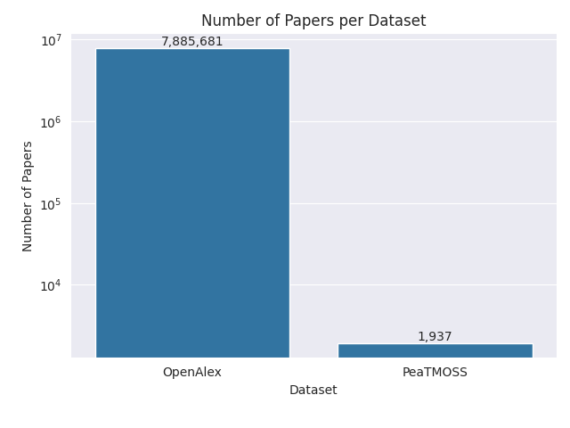
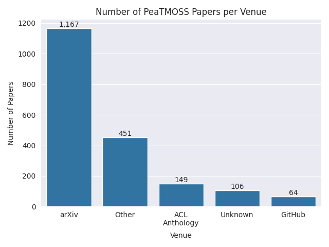
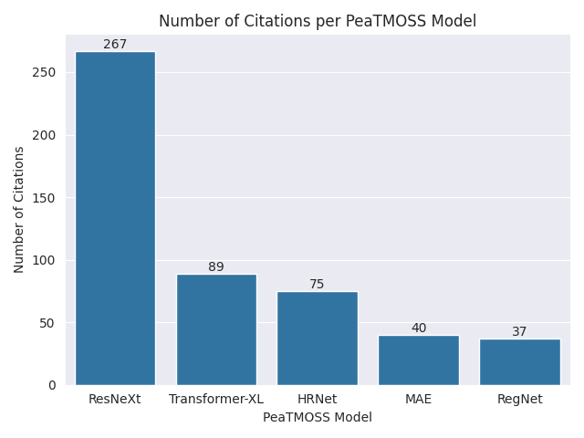
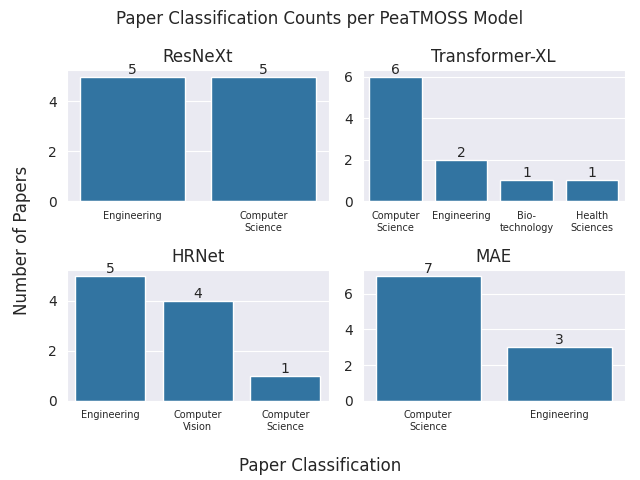

# Pre-Trained Model (PTM) Reuse Through Academic Transactions

> Prototyping if it is possible to identify where PTMs are used based on
> academic citations

## Table of Contents

- [Pre-Trained Model (PTM) Reuse Through Academic Transactions](#pre-trained-model-ptm-reuse-through-academic-transactions)
  - [Table of Contents](#table-of-contents)
  - [About](#about)
  - [How to Install](#how-to-install)
    - [Dependencies](#dependencies)
    - [Installation steps](#installation-steps)
  - [How to Run](#how-to-run)
    - [Downloading The Data](#downloading-the-data)
    - [Script Execution Order](#script-execution-order)
  - [Results](#results)

## About

This project was a four-week effort by undergraduate members of SSL who were
supported by the
[Undergraduate Research and Engagement Symposium](https://ecommons.luc.edu/ures/)
at Loyola University Chicago.

The goal of this project was to prototype a utility that would be able to:

- Load, search, and parse SQL queries made to both the OpenAlex and PeaTMOSS
  datasets,
- Measure usage of PTMs captured in PeaTMOSS within the OpenAlex dataset,
- Introduce students to graph databases through Neo4J,
- and create a small data app using Streamlit.

To that end, the students involved were able to successfully acomplish these
objectives *with the exception of finalizing the Streamlit application*.

## How to Install

This code has been tested on x86-64 Linux and Mac OS computers.

### Dependencies

- Python 3.10

### Installation steps

1. `git clone https://github.com/NicholasSynovic/research_ptm-reuse-through-academic-transactions prtat`
1. `cd prtat`
1. `make create-dev`
1. `source env/bin/activate`
1. `make build`

## How to Run

### Downloading The Data

See [\`data/README.md](data/README.md) for more information.

### Script Execution Order

- Generate AI classifications of abstracts

```shell
python src/stats/ai.py --help
Usage: ai.py [OPTIONS]

Options:
  -d, --dir PATH         Path to abstract directory to read files  [default:
                         ../../data/abstracts]
  -o, --output-dir PATH  Path to store JSON output  [default: ../../data/json]
  --help                 Show this message and exit.
```

- Plot data

```shell
python src/stats/plot.py --help
Usage: plot.py [OPTIONS]

Options:
  -p, --peatmoss PATH             Path to PeaTMOSS database  [required]
  -o, --openalex PATH             Path to OpenAlex database  [required]
  -a, --peatmoss-arxiv-citation-count-path PATH
                                  Path to pickled PeaTMOSS arXiv Citation
                                  Count  [default:
                                  ../../data/pickle/pmArXivCitations.pickle]
  -i, --ai-classification-path PATH
                                  Path to JSON file of AI classes  [default:
                                  ../../data/json/ai_nature_classes.json]
  --help                          Show this message and exit.
```

## Results

The following findings were made by the students:

- The number of papers captured within our OpenAlex sample far outnumbers the
  total number of papers captured within PeaTMOSS. This supports our hypothesis
  that some (if not all) of the PeaTMOSS papers are captured within the larger
  OpenAlex dataset.



- Most PeaTMOSS papers are published within arXiv.



- Of the 14 PeaTMOSS models identified within the OpenAlex sample, the ResNeXt
  model had the most citations.



- Of the top 4 most cited PeaTMOSS models, all models where used in papers
  within Computer Science and Engineering


